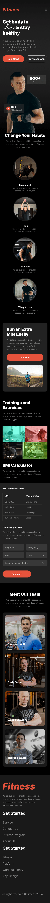

# Programming Hero Batch 10 Assignment 02

<figure>
  <figcaption>Screenshot 1 (on Desktop screen)</figcaption>
  
</figure>
<figure>
  <figcaption>Screenshot 2 (on Tablet screen)</figcaption>
  
</figure>
<figure>
  <figcaption>Screenshot 3 (on Mobile screen)</figcaption>
  
</figure>